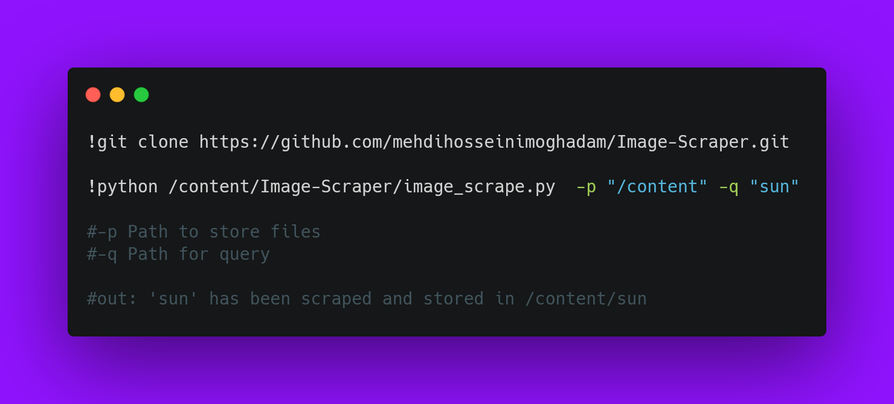

# Image-Scraper
Google based image scraper in python to make data set for computer vision

## How to use Image Scraper


```sh
!git clone https://github.com/mehdihosseinimoghadam/Image-Scraper.git

!python /content/Image-Scraper/image_scrape.py  -p "/content" -q "sun"

#-p Path to store files
#-q Path for query

#out: 'sun' has been scraped and stored in /content/sun

```
    
    
```python
from typing import Iterator

def fib(n: int) -> Iterator[int]:
    a, b = 0, 1
    while a < n:
        yield a
        a, b = b, a + b
```

<p align="center">
  
</p>
