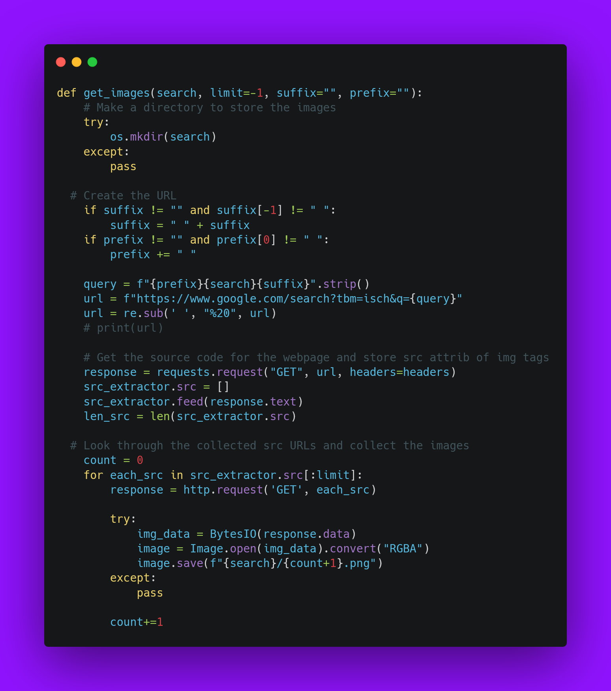

# Image-Scraper
Google based image scraper in python to make data set for computer vision

## How to use Image Scraper


```sh
!git clone https://github.com/mehdihosseinimoghadam/Image-Scraper.git

!python /content/Image-Scraper/image_scrape.py  -p "/content" -q "sun"

#-p Path to store files
#-q Path for query

#out: 'sun' has been scraped and stored in /content/sun

```
    
 
<p align="center">
  
</p>


## Main Function

<p align="center">
  
</p>
